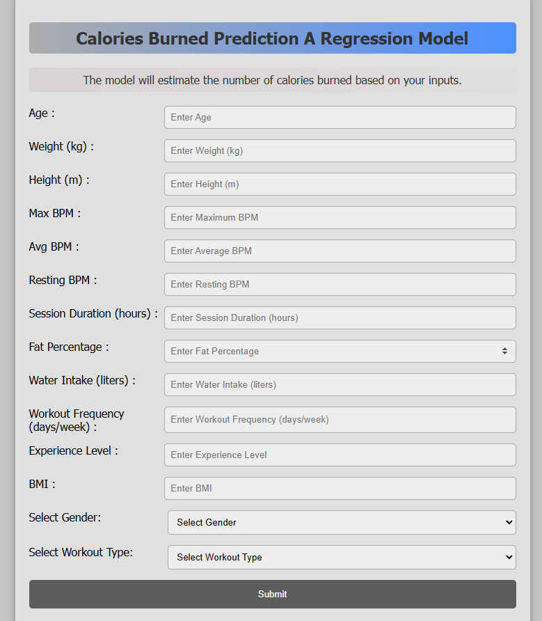
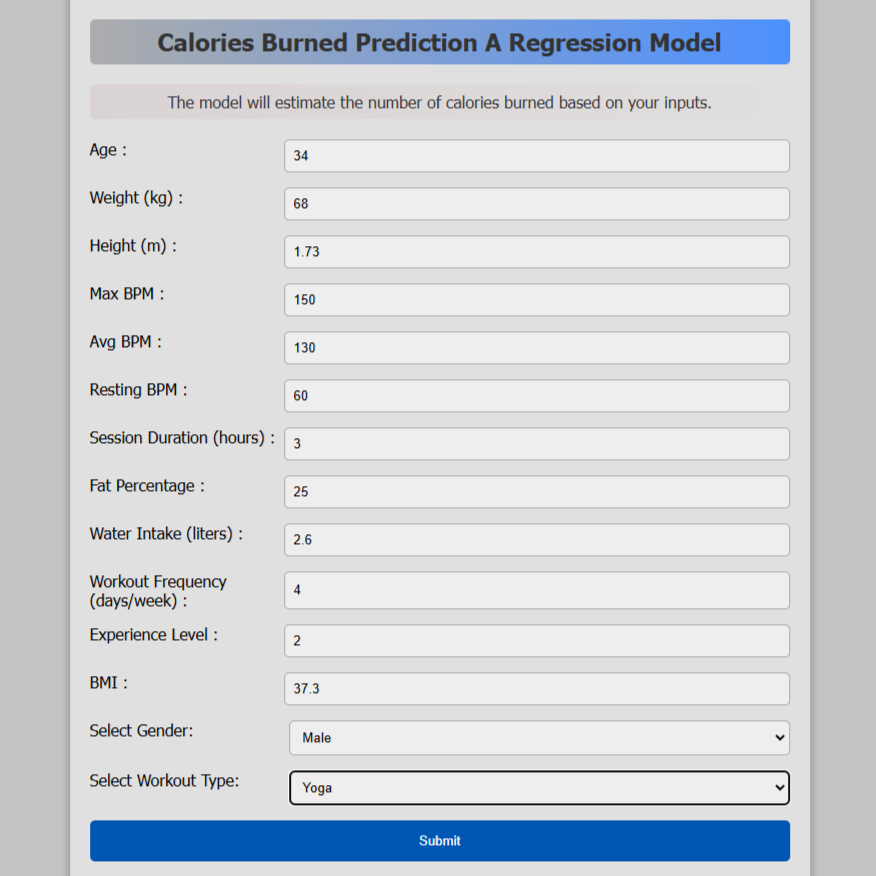
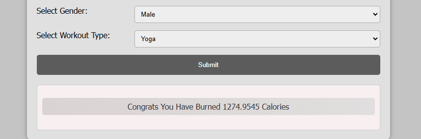

<h1> Calories Burned Prediction Regression Model </h1>

# Overview
This project involves building a regression model to predict the number of calories burned during exercise based on various input features such as age, weight, height, gender , session duration etc.. Also conducted A/B Testing Analsysis using statistic measures like chi-sqaure test , t-test , p_value , hypothesis testing etc to evaluate and have better statistical understanding of the relationship of features in the dataset.

# Installation
To get started, you'll need to have Python installed.

With the following libraries

1. pandas
2. numpy
3. matplotlib
4. seaborn
5. sklearn
6. Flask
7. Pickle

# Dataset
Have shared the csv file "gym_mem.csv" which is used for this project.
The dataset used for this model includes the following features:

1. Age	Gender	
2. Weight (kg)
3. Height (m)	
4. Max_BPM	Avg_BPM	
5. Resting_BPM	Session_Duration (hours)	
6. Calories_Burned	
7. Workout_Type	
8. Fat_Percentage	
9. Water_Intake (liters)	
10. Workout_Frequency (days/week)
11. Experience_Level	
12. BMI

# Model
The regression model is built using XGBoost which is an ensemble method.

The model is trained to minimize the mean squared error between the predicted and actual calories burned.

The model have scored "99.65%" Testing Accuracy. Model correctly predicts "99.65%" of the variability in the testing data.

# Results
The model's performance is evaluated using metrics such as Mean Squared Error (MSE) and R-squared (R²). 

The results are visualized using matplotlib to show the correlation between the predicted and actual values.

The model's scores for the evaluated metrics are the following:
1. MSE : 238.03062993528332
2. MAE : 11.468836831783063
3. RMSE : 15.428241310508573
4. R-Squared : 0.9961636614263105

# Images 

## HomePage:

## User Inputs:

## Results:

# Contributions
Please Feel free to contribute to this project by submitting issues or pull requests. 

Any enhancements, bug fixes, or optimizations are extremely welcomed!

